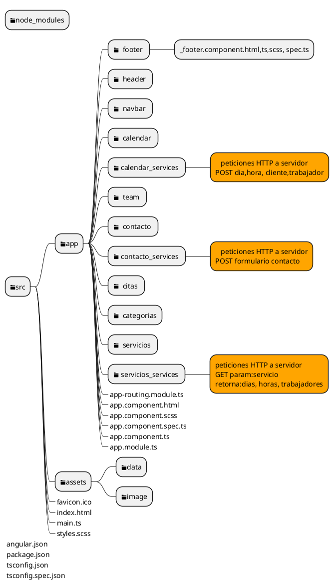
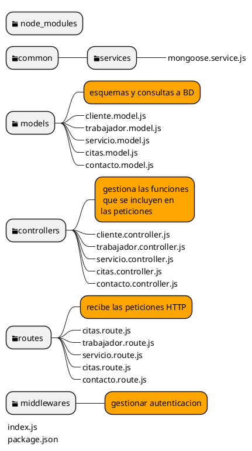

#

## Frontend

```plantuml
@startmindmap

** <&folder>node_modules
* <&folder>src
** <&folder>app

*** <&folder>  footer 
**** _footer.component.html,ts,scss, spec.ts
*** <&folder>  header 
*** <&folder>  navbar 
*** <&folder>  calendar 
*** <&folder> calendar_services 
****[#Orange]:   peticiones HTTP a servidor   
POST dia,hora, cliente,trabajador;
*** <&folder>  team 
*** <&folder>  contacto 
*** <&folder> contacto_services 
****[#Orange]:   peticiones HTTP a servidor   
POST formulario contacto;
*** <&folder>  citas 
*** <&folder>  categorias
*** <&folder>  servicios 
*** <&folder> servicios_services 
****[#Orange]:peticiones HTTP a servidor 
GET param:servicio 
retorna:dias, horas, trabajadores;
***_ app-routing.module.ts
***_ app.component.html
***_ app.component.scss
***_ app.component.spec.ts
***_ app.component.ts
***_ app.module.ts 
** <&folder>assets
*** <&folder>data
*** <&folder>image
**_ favicon.ico
**_ index.html
**_ main.ts
**_ styles.scss
*_ angular.json
*_ package.json
*_ tsconfig.json
*_ tsconfig.spec.json
@endmindmap
```

## Backend

```plantuml
@startmindmap
** <&folder> node_modules
* <&folder>common
** <&folder>services
***_ mongoose.service.js

* <&folder> models
**[#Orange] esquemas y consultas a BD
**_ cliente.model.js
**_ trabajador.model.js
**_ servicio.model.js
**_ citas.model.js
**_ contacto.model.js
* <&folder>controllers
**[#Orange]: gestiona las funciones
 que se incluyen en 
las peticiones;
**_ cliente.controller.js
**_ trabajador.controller.js
**_ servicio.controller.js
**_ citas.controller.js
**_ contacto.controller.js
* <&folder>routes 
**[#Orange] recibe las peticiones HTTP
**_ citas.route.js
**_ trabajador.route.js
**_ servicio.route.js
**_ citas.route.js
**_ contacto.route.js
* <&folder> middlewares
**[#Orange] gestionar autenticacion
*_ index.js
*_ package.json
@endmindmap
```